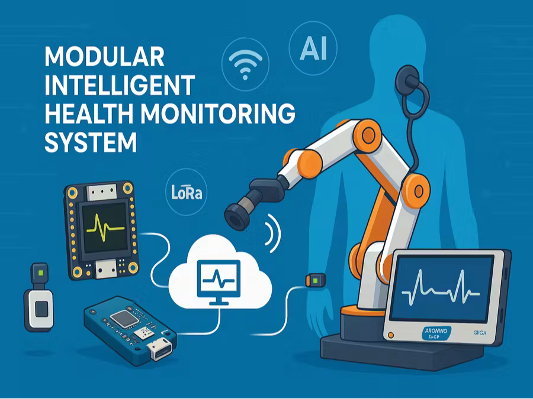

# MachineBuilderContest

# 🏥 Intelligent Health Care Beacon

A **low-cost, modular**, and **AI-powered** remote health monitoring system designed for rural areas, expeditions, and environments with limited medical infrastructure. It enables real-time acquisition, classification, and transmission of biosignals to support early detection and continuous care.





---

## 🚀 Features

- ✅ ECG (electrocardiogram) signal acquisition using BDM-101  
- ✅ Digital stethoscope for heart and respiratory sound capture  
- ✅ Robotic arm for automated auscultation  
- ✅ Real-time monitoring of Heart Rate, SpO2, and GSR  
- ✅ AI-based ECG classification (e.g., atrial fibrillation detection)  
- ✅ Multi-protocol communication: **LoRa, LTE-M, NB-IoT, WiFi, BLE**  
- ✅ Rugged design: Shockproof and waterproof enclosure  
- ✅ Cloud connectivity for remote diagnosis and alerts  

---

## 📦 Hardware Components

- [Boron 404X](https://docs.particle.io/boron/)
- BDM-101 ECG Sensor  
- Digital stethoscope  
- Robotic arm (custom or commercial)  
- SSD1306 OLED Display  
- Additional sensors: GSR, PPG, SpO2  
- Rechargeable LiPo Battery or Power Supply  

---

## 🧠 AI & Signal Processing

The system leverages embedded AI to classify ECG signals and identify arrhythmias such as **atrial fibrillation**.  
Future enhancements will integrate:

- 🩺 Blood pressure monitoring  
- 🧪 Glucometer readings  
- 🧬 Multimodal signal fusion for advanced diagnostics  

---

## 📡 Communication Protocols

- **LoRa** – Long-range, low-power  
- **LTE-M / NB-IoT** – Cellular connectivity  
- **WiFi** – Local wireless communication  
- **BLE** – Bluetooth Low Energy for wearable integration  

Data is transmitted securely to the cloud or local dashboards for remote visualization and early alerts.

---

## 🔧 Setup & Usage

```bash
git clone https://github.com/<your-username>/intelligent-health-care-beacon.git
cd intelligent-health-care-beacon

